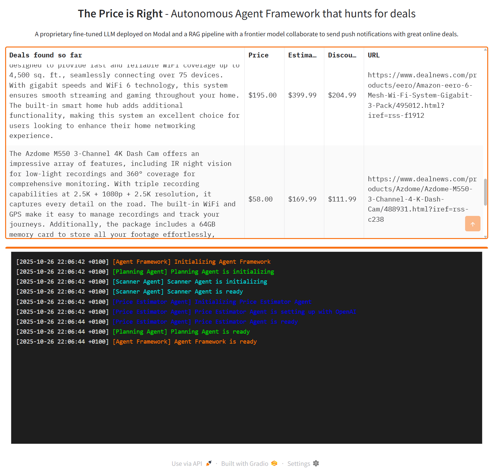

# 🛍️ Deals Finder Agent

[](https://gradio.app/)


An autonomous multi-agent AI system that continuously monitors online deals, estimates fair market prices using RAG (Retrieval-Augmented Generation), and surfaces only the best discounts—all automated with a clean Gradio interface.

This project uses the most performing AI price predictor from [NEGU LLM Regressor](https://github.com/NEGU93/llm_regression) project to find good deals and prices.



> [!note]
> The RAG documents are old, therefore, the price estimator may over estimate the price of old products, mainly for technology ones.

## 🏗️ Architecture


This system autonomously:
1. **Scrapes** deal listings from multiple RSS feeds (DealNews)
2. **Structures** deal information using Structured Outputs using Pydantic
3. **Estimates** fair market prices estimation using a RAG pipeline with ChromaDB
4. **Calculates** potential savings (discount = estimated_price - actual_price)
5. **Filters** deals to only show discounts greater than $50
6. **Displays** results in a real-time dashboard with auto-refresh


## 🚀 Quick Start

### Prerequisites

- Python 3.8+
- OpenAI API key
- Hugging Face account (for dataset download)

### Installation

0. **Set up environment variables**

Create a `.env` file in the project root:
```bash
OPENAI_API_KEY=your_openai_api_key_here
HF_TOKEN=your_huggingface_token_here
```

1. **Download and create the database**

This step downloads the pricing dataset from [Hugging Face](https://huggingface.co/datasets/NEGU93/pricer-data) and creates the ChromaDB vector database:

```bash
python -m src.create_db
```

> [!note]
> This step is required for the price estimator to work. The database contains historical product data used for RAG-based price estimation.

2. **Run the application**
```bash
python src/app.py
```

The Gradio interface will automatically open in your browser.

## 🔧 How Each Component Works

### 1. **App (app.py)**
- **Role:** User Interface
- **Tech:** Gradio
- **Features:**
  - Real-time deal table with product description, price, estimate, discount
  - Live logging panel showing agent activity
  - Auto-refresh every 5 minutes

### 2. **DealAgentFramework (deal_agent_framework.py)**
- **Role:** Orchestrator & Memory Manager
- **Responsibilities:**
  - Manages ChromaDB connection
  - Handles persistence (`memory.json` read/write)
  - Initializes `PlanningAgent`
  - Tracks all discovered opportunities

### 3. **PlanningAgent (planning_agent.py)**
- **Role:** Workflow Coordinator
- **Process:**
  1. Calls `ScannerAgent` to find new deals
  2. For the top 5 deals, calls `GPT4MiniRAG` to estimate prices
  3. Calculates discount (estimated_price - actual_price)
  4. Sorts opportunities by discount (highest first)
  5. Returns the best deal if discount > $50
- **Key Parameter:** `DEAL_THRESHOLD = 50` (minimum discount in dollars)

### 4. **ScannerAgent (scanner_agent.py)**
- **Role:** Deal Discovery
- **Process:**
  1. Scrapes 5 RSS feeds from DealNews (up to 10 deals each)
  2. Extracts title, summary, detailed description, and features
  3. Filters out deals already in memory (deduplication)
  4. Uses GPT-4o-mini with **Structured Outputs** to:
     - Select the 5 most detailed deals
     - Extract clear product descriptions
     - Parse exact prices
  5. Returns structured `DealSelection` object
- **Categories Monitored:**
  - Electronics
  - Computers
  - Automotive
  - Smart Home
  - Home & Garden

### 5. **GPT4MiniRAG (gpt_rag_mini.py)**
- **Role:** Price Estimation via RAG
- **Process:**
  1. Encodes product description to vector using SentenceTransformer
  2. Queries ChromaDB for 5 most similar products
  3. Retrieves similar products and their prices
  4. Creates context prompt with examples
  5. Calls GPT-4o-mini to estimate price based on context
  6. Extracts numeric price from response
- **Tech Stack:**
  - SentenceTransformer (for embeddings)
  - ChromaDB (vector database)
  - GPT-4o-mini (LLM)

## 🎮 Usage

### Running Individual Agents for Testing

> [!tip]
> You can run each agent indivisually for testing porpuses

```bash
# Test the full framework
python -m src.agents.deal_agent_framework

# Test the planning agent
python -m src.agents.planning_agent

# Test the scanner agent
python -m src.agents.scanner_agent

# Test the price estimator
python -m src.agents.gpt_rag_mini
```

### Customizing Deal Threshold

Edit `src/agents/planning_agent.py`:
```python
DEAL_THRESHOLD = 50  # Change this value (in dollars)
```

### Adjusting Scan Frequency

Edit `src/app.py`:
```python
timer = gr.Timer(value=300, active=True)  # Change 300 (seconds)
```
